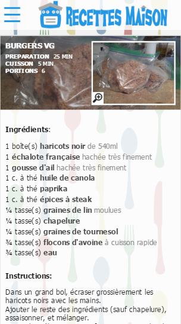
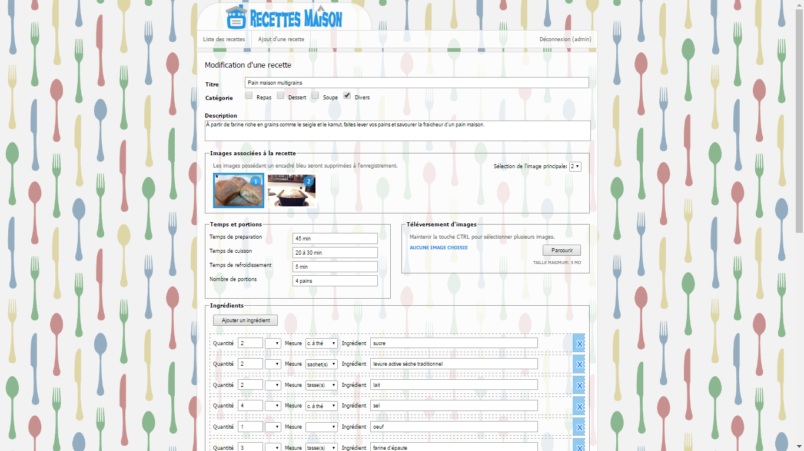

A website to administrate your own personal recipes, that's your online cookbook. It's really user-friendly to add and edit recipe as an admin.

You can find a working demo here:
http://205.236.12.41:8080/recette

This is also working on mobile. I used my own CSS Media Query. 
No bootstrap was used in this project, but I used one in my other JAVA web project.

